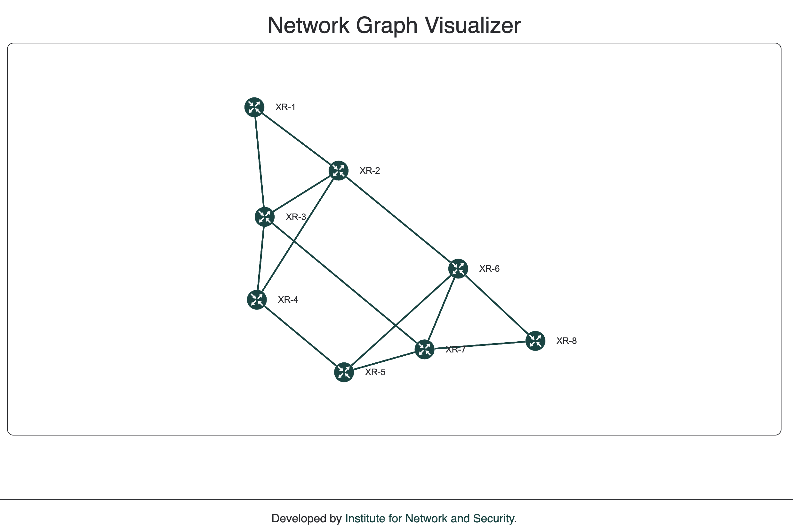

# Network Graph Visualizer Frontend

This part of the Network Graph Visualizer is the Frontend written in Typescript using the React library.

## What does the Frontend do

The Frontend queries the Network Graph Visualizer API for the network topology and shows it on a webpage. All data is coming from the Jalapeño instance queried by the API.



## How to run the Frontend

You can either build the docker container from the repository or run it directly.

```
cd docker 
docker build -t network_graph:latest -f Dockerfile ../
docker run -p 3000:3000 network_graph:latest
```

## How to run the Frontend directly from the repository

Run the following:

```
npm install
npm start
```

Make sure to set the API address in configs/config.ts

## Configuration

Make sure to configure the Frontend under `configs/config.ts`


